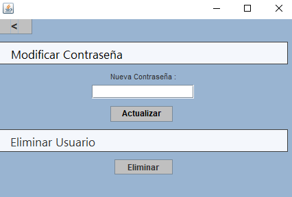

# Ferial
Proyecto Programación

1º Resumen de la aplicación:

Se trata de una aplicación dirigida a un público joven, que no tengan casetas privadas en la feria o turistas que vengan a visitarla.

Intenta facilitar a los clientes el buscar aleatoriamente y tener que preguntar sobre las casetas, disponibilidad y calidad de las mismas, por medio de un listado o un mapa según la elección de la persona, se mostrará el estado de las casetas públicas, es decir, si están abiertas o cerradas, el aforo, la dirección y las opiniones en una vista distinta, pudiendo interactuar publicando las opiniones propias.

2º Estructura de datos:

3º Vistas de la aplicación:

Abajo encontramos la vista para el login y el registro de usuarios.

Una vez dentro observamos las siguiente opciones: cerrar sesión, ajustes, casetas y mapa.

En ajustes nos permite eliminar el usuario o modificar la contraseña, se encuentran dentro del perfil del usuario para evitar errores.

Esta vista  muestra una tabla con un listado de todas las casetas existentes en la base de datos con sus respectivas informaciones, a la derecha se aprecian unos botones para acceder a la vista específica de dicha caseta.

E n la vista Mapa aparece de forma más gráfica el número de las casetas con colores, dichos colores representan el estado de las casetas en el momento,al pulsarlo te llevará a otra vista con la información específica de la caseta seleccionada.

Esta es la vista a la que se accede seleccionando el botón al que nos hemos referido en las vista de mapa y listado, se verán las opiniones de los usuarios, la posibilidad abajo de publicar la opinión del propio usuario y por último arriba a la derecha el botón estado para cerrar o abrir la caseta.

